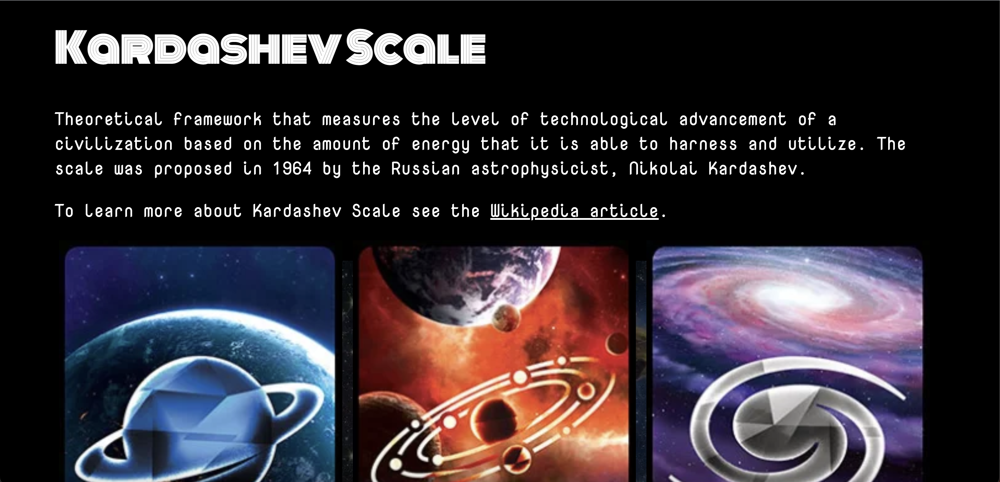

# Kardashev Scale 

Boca Code Week 4 Kardashev Scale: This project is a webpage that provides information about the Kardashev Scale, a theoretical framework for measuring the technological advancement of civilizations based on energy utilization. The webpage is built using HTML, Vanilla JavaScript, and CSS.

## Features

- Clear and structured HTML markup for organizing the content and creating different sections.
- Styling using CSS to enhance the visual appearance and layout of the webpage.
- Vanilla JavaScript is utilized to dynamically generate the current year in the footer.
- Informative text descriptions and images are provided for each type of civilization in the Kardashev Scale.
- A video embedded from YouTube explains the concept of the Kardashev Scale in more detail.

## Usage

To view the webpage, simply open the `index.html` file in a web browser, or [click here](https://v-cazeau.github.io/kardashev-scale/). The content will be displayed with the appropriate styling and functionality.

## Graphics 

[Unfilter Gamer: Kardashev Scale](https://unfilteredgamer.com/review-kardashev-scale/)

## Resources
- [Wikipedia article on the Kardashev scale](https://en.wikipedia.org/wiki/Kardashev_scale)
- [YouTube video explaining the Kardashev Scale](https://www.youtube.com/embed/rhFK5_Nx9xY)

## Special thanks to
- [Boca Code](https://github.com/bocacode) for providing the learning resources.
- [Jiho Sohn](https://github.com/jsohndata) for his invaluable instruction, guidance, and support throughout the development process.

Please note that the content of this webpage is for educational and informational purposes only and does not represent scientific or factual claims about the Kardashev Scale.

---
*This project was developed as part of the Boca Code curriculum.*